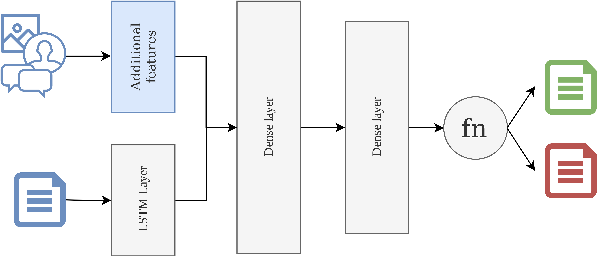

# Fake news detection

**Authors:** Peter Mačinec & Simona Miková

## Motivation

With the rise of social media, more and more people are using the Internet as a primary source of information. Information shared in the social media can be sometimes misleading and can have impact on various aspects of society. Retrieving information from the non-credible sources such as amateur news portals, blogs or discussion forums can be dangerous, especially in the domain of health and medicine. Majority of information shared this way promote scientifically unverified treatment procedures or spread the scare of traditional medical methods. Existing works are primarily focused on using textual attributes and common machine learning algorithms, without exploiting the potential of multimodal features and modern neural networks. Motivated by these facts, we decided to provide a neural network based method that can help to solve the problem of spreading misinformation.

## Related works

Misinformation problem is rapidly increasing. Because of this, still more works are focused on news credibility verification (or just fake news detection).

Depending on chosen dataset, variety of attributes are being used. To improve detecting of non-credible articles or posts, different attribute types such as text content, sharing or author metadata can be combined [1]. When using textual attributes of posts or articles, neural networks are becoming more popular. LSTM (Long-Short Term Memory) networks are usually used with quite a good results achieved [2, 3]. Also, combination of different neural network types to improve detection was proposed [2].

Although a lot of methods were proposed, misinformation and credibility verification is still a challenging problem. To the best of our knowledge, no method combining the power of neural networks in text classification and multimodal features such as time series or discussions was proposed.

## Dataset

For solving this problem and train our algorithms, we are using data from [Monant platform](https://documenter.getpostman.com/view/8615295/SVtPWq1j?version=latest#7f81cb35-db90-4eaf-acd0-a177aa5a9077). Articles provided by Monant platform are primarily focused on medicine disinformation. The dataset contains approximately 195k news from more than 100 different sources. Data are unbalanced, only approximately 37k of articles come from reliable sources. In the data, there are different types of attributes provided such as news body and title, images or discussions. We will label articles in this dataset by the source where are published. Articles from sources that are considered unreliable are automatically labeled unreliable and vice versa. Of course, labels obtained this way are not perfect but we still believe they can be used to help us reduce disinformation. 

## Solution proposal

Our method for fake news detection (or detection of unreliable news articles) is based on using two types of features:
1. textual attributes of article (such as body and title)
1. contextual features (discussions related to articles, images, etc)

For processing the textual attributes, we will use LSTM layer. We have chosen LSTM because of its two major advantages - handling arbitrary length of input and dealing with long-term dependencies. Both of them are useful when dealing with articles or longer documents.
 
The architecture is shown on the image below, however does not include details such as number of neurons in each layer, activation functions or length of input. All of those parameters can be tuned later to achieve best results. We can say that also the architecture or number of dense layers can change in the future depending on the data.

Because it is not clear which of the contextual information we are going to use (it depends on the exploratory analysis), it is illustrated only with blue rectangle for now. Depending on the type of contextual data, this rectangle may be replaced with feature engineering, or another LSTM or even convolutional layers.

## References

[1] C. Castillo, M. Mendoza, and B. Poblete. 2011. Information credibility on twitter. In *Proceedings of the 20th international conference on World wide web (WWW '11)*. ACM, New York, NY, USA, 675-684.

[2] O. Ajao, D. Bhowmik, and S. Zargari. 2018. Fake News Identification on Twitter with Hybrid CNN and RNN Models. In *Proceedings of the 9th International Conference on Social Media and Society (SMSociety '18)*. ACM, New York, NY, USA, 226-230.

[3] N. Ruchansky, S. Seo, and Y. Liu. (2017). CSI: A Hybrid Deep Model for Fake News Detection. In *Proceedings of the 2017 ACM on Conference on Information and Knowledge Management - CIKM '17*. ACM, New York, NY, USA. 797-806.
