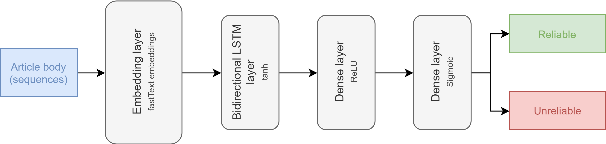

# Fake news detection
**Authors:** Peter Mačinec & Simona Miková

## Problem Statement
Our task is to clasify article reliability using neural network model. 

*Given the article body as an input, our neural network model will classify its appropriate label (reliable/unreliable).”*

## Our model architecture 

Full architecture of our model is shown in the picture below:

**Embedings layer**    
First layer in our model is Embedding layer. We are using pre-trained fastText embeddings as weigths initialization, but then it is not trainable. Then, before sending it to LSTM layer we mask the added padding, so LSTM layer would ignore all 0 in sequences.

**Bidirectional LSTM layer**    
Next we are using Birirectional LSTM layer, because we are dealing with longer textual data (articles). This layer has 64 units (this is also hyperparameter for us).

**Dense layer**   
Then we have Dense layer with ReLu activation function and same number of units as LSTM layer before. Number of these layers is hyperparameter and can be easily changed.

**Final Dense layer**  
Final layer is Dense layer with sigmoid activation function and 1 unit. It returns values from -1 to 1, which can determine whether article is fake or not.

### Hyperparameters

All of those parameters can be tuned to achieve best results:

* vocabulary size
* dimension of embeddings
* optimizer
* number of units in LSTM and Dense layers (64 by default)
* number of hidden Dense layers
* maximum words in vocabulary to use
* maximum length of all sequences

## Experiments

### Dataset
We are using dataset  from Monant platform. It contains medical articles aquired from a variety of sources. Data were cleaned during preprocessing and only body and label columns were kept. Label column were balanced  additionaly (now containing 32856  records for each class). 

### Training
In training we have been using these parameters:
* Adam as optimizer (this one can be also changed, because it is hyperparameter),
* binary_crossentropy as loss function,
* accuracy as a metric.